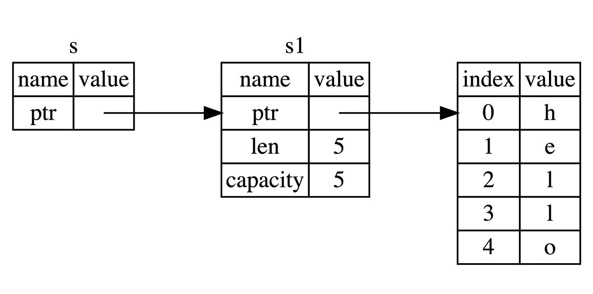

本文尝试从逆向角度来学习rust特性。

# 1.交叉编译

因为我用的是macOS arm，但是我不熟悉arm汇编，所以需要交叉编译到x64架构来分析rust。

```shell
rustup target list | grep win
rustup target add x86_64-apple-darwin
cargo build --target x86_64-apple-darwin
```

# 2.所有权

rust实现了垃圾回收，但是没有使用gc，而是创造了一种新的概念**所有权**，所有权的检查在编译期进行，所以从生成的汇编代码来看是看不到所有权的存在的。

牢记以下3个概念：

1. Rust 中每一个值都被一个变量所拥有，该变量被称为值的所有者
2. 一个值同时只能被一个变量所拥有，或者说一个值只能拥有一个所有者
3. 当所有者(变量)离开作用域范围时，这个值将被丢弃(drop)

所有权是为了实现垃圾回收以及避免野指针和数据竞争。

```rust
fn main() {
    let s1 = String::from("hello"); //s1是指针，指向分配在堆上的String。
    println!("s1.as_ptr = {:p}", s1.as_ptr());
    println!("&s1 = {:p}", &s1);
    let s2 = s1; //所有权move
    println!("s2.as_ptr = {:p}", s2.as_ptr());
    println!("&s2 = {:p}", &s2);
    println!("----------");
    let s3 = &s2;
    println!("&s3 = {:p}", &s3);
    println!("s3 = {:p}", s3);
    println!("s3.as_ptr = {:p}", s3.as_ptr());

    let s4 = &s2;
    println!("&s4 = {:p}", &s4);
    println!("s4 = {:p}", s4);
    println!("s4.as_ptr = {:p}", s4.as_ptr());
}
```

```
s1.as_ptr = 0x60000346c050
&s1 = 0x16f23aab8
s2.as_ptr = 0x60000346c050
&s2 = 0x16f23ab60
----------
&s3 = 0x16f23ac38
s3 = 0x16f23ab60
s3.as_ptr = 0x60000346c050
&s4 = 0x16f23ad10
s4 = 0x16f23ab60
s4.as_ptr = 0x60000346c050
```


根据第二条规则，**一个值同时只能被一个变量所拥有，或者说一个值只能拥有一个所有者**。即一个地址只能被一个指针指向。`let s2 = s1`时`&s1 = 0x16f23aab8 -> &s2 = 0x16f23ab60`，同时在编译期s1不能再被访问，即**所有权的转移**。

# 3.借用

```rust
fn main() {
    let s1 = String::from("hello"); //s1是指针，指向分配在堆上的String。
    println!("s1.as_ptr = {:p}", s1.as_ptr());
    println!("&s1 = {:p}", &s1);
    let s2 = s1; //所有权move
    println!("s2.as_ptr = {:p}", s2.as_ptr());
    println!("&s2 = {:p}", &s2);
    println!("----------");
    let s3 = &s2;	//借用
    println!("&s3 = {:p}", &s3);
    println!("s3 = {:p}", s3);
    println!("s3.as_ptr = {:p}", s3.as_ptr());

    let s4 = &s2;
    println!("&s4 = {:p}", &s4);
    println!("s4 = {:p}", s4);
    println!("s4.as_ptr = {:p}", s4.as_ptr());
}
```

```
s1.as_ptr = 0x60000346c050
&s1 = 0x16f23aab8
s2.as_ptr = 0x60000346c050
&s2 = 0x16f23ab60
----------
&s3 = 0x16f23ac38
s3 = 0x16f23ab60
s3.as_ptr = 0x60000346c050
&s4 = 0x16f23ad10
s4 = 0x16f23ab60
s4.as_ptr = 0x60000346c050
```



根据第二条规则，**一个值同时只能被一个变量所拥有，或者说一个值只能拥有一个所有者**。即一个地址只能被一个指针指向。但是为什么`s3 = 0x16f23ab60 -> s3 = 0x16f23ab60`，却能同时指向`0x16f23ab60`呢？我的理解是，规则上所指的值是一个对象，比如s1就是一个String对象。即**一个对象同时只能被一个变量所拥有，或者说一个对象只能拥有一个所有者**。而s3只是一个常规指针（当然它也可以是一个对象，在这里我们不认为它是一个对象），指向了对象，这样就能理解为什么多个指针能同时指向一个对象了。呵呵，如果多个指针**不能**同时指向一个对象的话，那么所有类型的操作都会是**深拷贝**。

**但是这样又发生了一个问题，多个指针指向一个对象可能会导致数据竞争，所以rust还有一套借用规则。**

总的来说，借用规则如下：

1. 同一时刻，你只能拥有要么一个可变引用, 要么任意多个不可变引用
2. 引用必须总是有效的